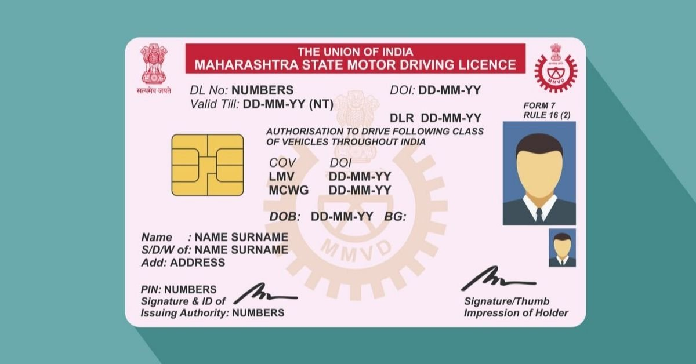
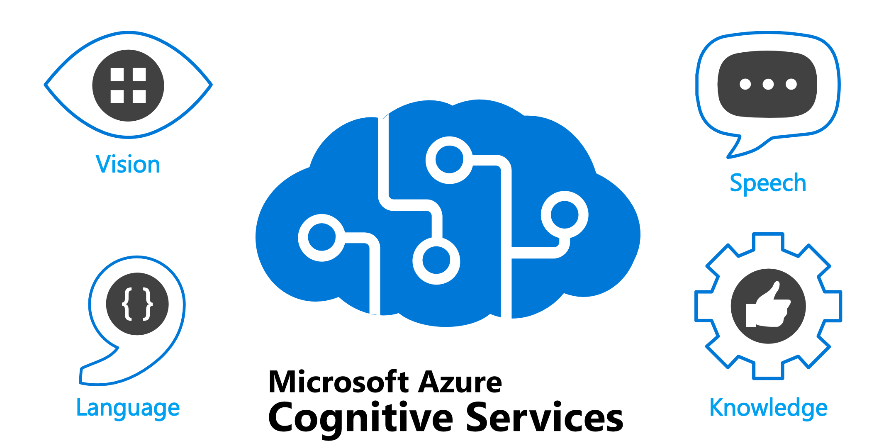
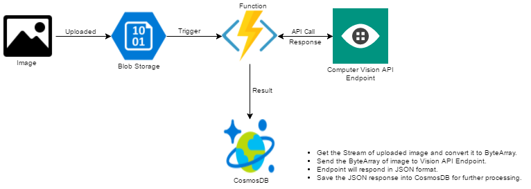
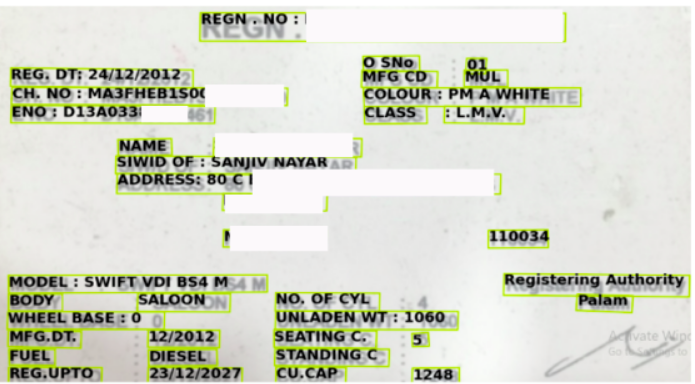

# Extracting information from drving license using OCR
## Overview
<b>In this project i have created a model which can extract specific information from driving license mainly belonging to Delhi and other two states of india with around 10 different formats . I have used coginitive vision OCR api for text detection .The model gives around 90% accuracy(field wise) on fields such as Registration number , Engine number , Reg date ,Name , VIN number or Chassis number (typically 17 digit long) , MFG date etc.</b>

  
    

## API selection
As we have to do extraction of some information from an image. We need to use OCR(Optical character recognition ) technique to do the task , but as most of the open source OCR api’s are good enough to work with but they didn’t provide best results .So i decided to go with Microsoft azure cognitive vision ocr api  . First I used its OCR service after a while I realised that going with cognitive vision handwritten text recognition api might be more insightful because it's going to have some NLP algorithms within it as I worked with NLP a lot in the past .

<b> API selection : “azure cognitive vision handwritten text recognition api </b>

  
    

## Preprocessing of the Images:

### Resizing the Image:

As the dataset contains images of different sizes .So we have to resize all images to a constant because we have to apply a lot of coordinate relation between the different text within a single image. Otherwise it’s hard to handle with varying sizes.  

### Skewness Correction of textual alignment or correction of orientation of images:

Cognitive api provide you with feature(parameter) to find out the textual alignment by try to read the text from all 360 degree.

But the problem is that it doesn’t return the coordinates with new alignment , but it sends it in respect to the original due to which we have to first get the alignment angle then apply to it , then save it in your local computer, then pass it again. Otherwise we didn’t get aligned coordinates which is going to create problems in textual processing in the next step .

## Calling Api

  
    

After that , If we make a call to api with an image it returns a json formatted file.

It provides you with the coordinates of corners of textual block  after plotting these block onto the image.

### Textual processing:

  
    

A lot of textual processing requires such as splitting the words seperately , removing the typos like(colon, commas etc) . Other than that there also defining the relationship between words include mapping such key(name)-value(name).
After that we can use python pandas dataframe to convert the list formatted result into proper csv or excel format.After converting into csv or excel:

## Accuracy:

In this particular case the a lot metric accuracy we can define , but i go for the following:
                
Most suitable:

Simply checking fields wise , how many time models are able to recognize the name or registration no.. etc correct. Then calculate the F1 score ,accuracy, precision ,recall based on that.

                

                Acc = (Total number of fields matched) / 6 X (total number of test cases)

#### Final accuracy was about 89.6 percent on test dataset

